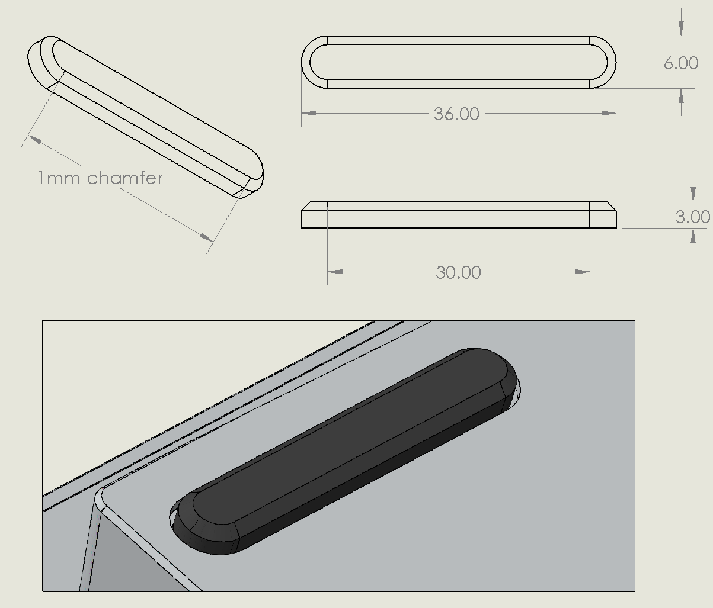
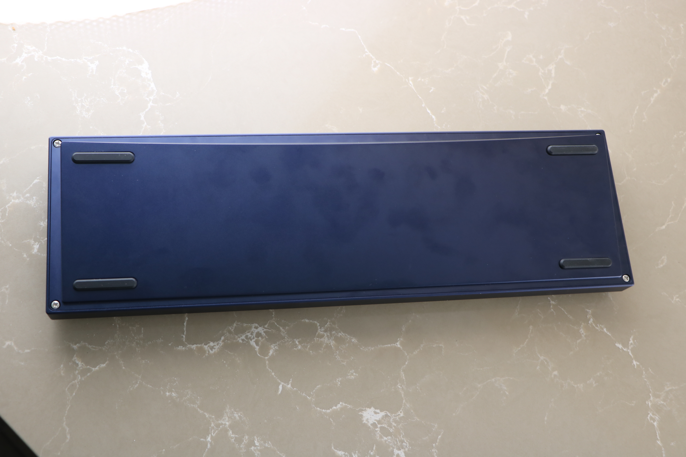

# Bachoo Bumpons

These custom bumpons are made of rubber with an adhesive top for use in custom mechanical keyboard projects. 

# Specifications

Width: 36mm

Height: 6mm

Thickness: 3mm

1mm×45° chamfer

**Note:** When adding feet holes to your model, please add an extra 0.25mm offset from these specifications, to account for rubber expansion and compression when in use.

